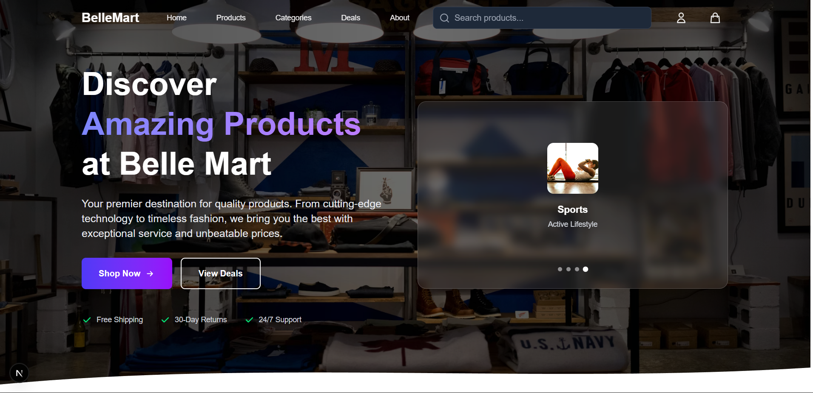
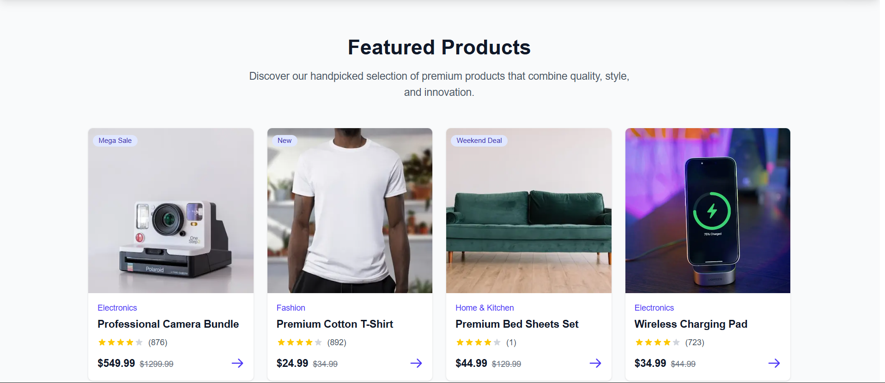
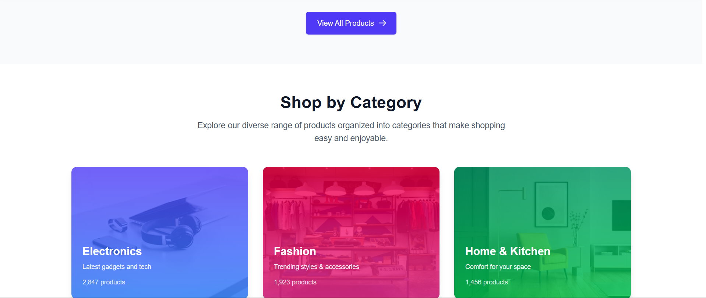
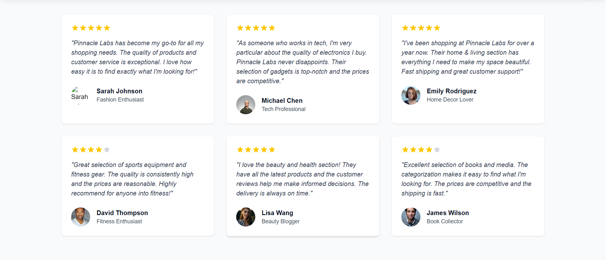
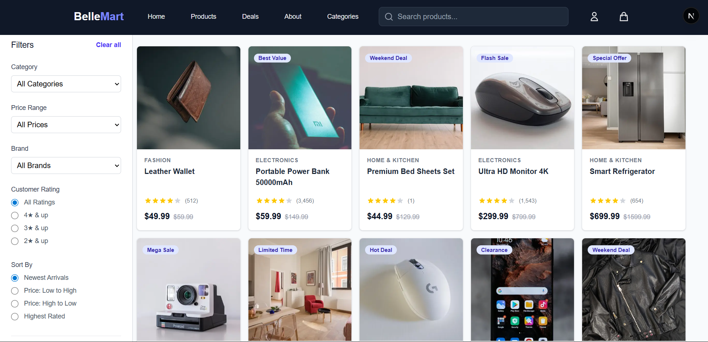
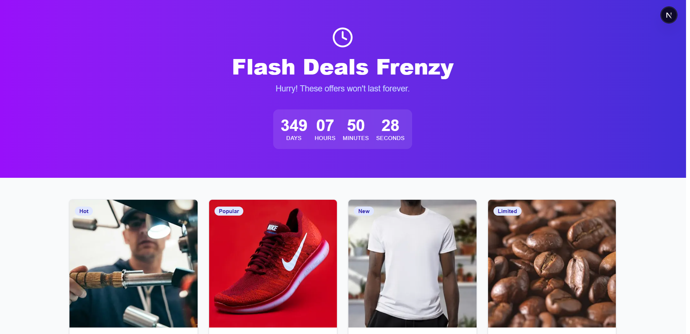
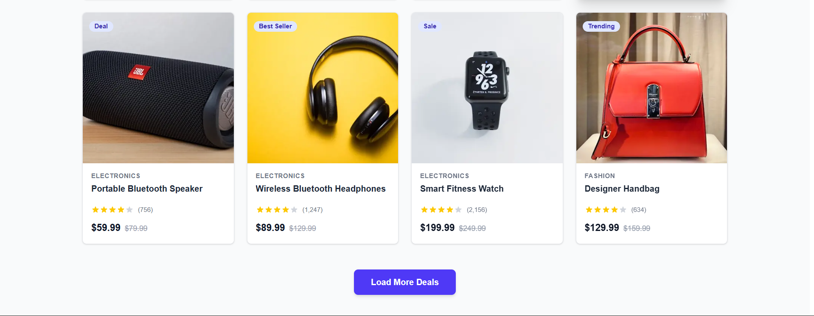

# Ecommerce Platform

A full-stack ecommerce application built with modern web technologies, featuring a React/Next.js frontend, Python FastAPI backend, and MongoDB database.

---

## ⚠️ IMPORTANT CAUTION

**Database Availability Issue**: This application uses MongoDB Atlas on a **free tier instance**. The cluster may be automatically shut down due to inactivity periods. If you experience any of the following issues:

- Pages fail to load or load indefinitely
- Signup/Sign in buttons don't work
- "500 Internal Server Error" messages
- Product listings not appearing
- Cart or order operations failing

**The cause is likely that the MongoDB Atlas cluster has been shut down due to inactivity.** This is a known limitation of the free tier. The cluster will automatically restart when accessed again, but there may be a delay (typically 5-10 minutes).

**Solution**: Contact the project maintainer to restart the cluster or deploy the database to a paid tier or self-hosted MongoDB instance for production use.

---

## 🚀 Features

- **User Authentication**: Secure signup, signin, and logout with JWT tokens and OTP verification
- **Product Management**: Browse, search, and filter products with detailed product pages
- **Shopping Cart**: Add/remove items, manage quantities with persistent cart storage
- **Checkout**: Complete checkout process with order creation and management
- **User Addresses**: Add, edit, and manage multiple delivery addresses
- **Order History**: View previous orders and track order details
- **Location Services**: Google Maps integration for location-based features
- **Search & Filters**: Advanced product search and filtering capabilities
- **Deal Pages**: Featured deals and promotional products
- **User Profiles**: Manage user account information and preferences
- **Image Upload**: Product and user image uploads via Cloudinary
- **Responsive Design**: Fully responsive UI optimized for all devices

## 📸 Screenshots

### Application Overview
















## 🛠️ Tech Stack

### Frontend Technologies
[](https://nextjs.org/)
[](https://react.dev/)
[](https://tailwindcss.com/)
[](https://developer.mozilla.org/en-US/docs/Web/JavaScript)

### Backend Technologies
[](https://fastapi.tiangolo.com/)
[](https://www.python.org/)

### Database
[](https://www.mongodb.com/)
[](https://mongoosejs.com/)

### Authentication & Security
[](https://jwt.io/)
[](https://www.npmjs.com/package/bcrypt)

### APIs & Services
[](https://maps.google.com/)
[](https://cloudinary.com/)

### Additional Libraries
[](https://www.framer.com/motion/)
[](https://zod.dev/)
[](https://react-hot-toast.com/)

---

### Detailed Tech Stack

### Frontend
- **Framework**: Next.js 15
- **UI Library**: React 19
- **Styling**: Tailwind CSS
- **Database ODM**: Mongoose
- **Authentication**: JWT (Jose), Bcrypt
- **APIs**: 
  - Google Maps API
  - Cloudinary
  - Leaflet/React-Leaflet for maps
- **Utilities**: 
  - React Hot Toast for notifications
  - Framer Motion for animations
  - Zod for validation
  - Date-fns for date manipulation

### Backend
- **Framework**: FastAPI (Python)
- **Database**: MongoDB
- **Authentication**: JWT
- **Email**: SMTP (Nodemailer integration)
- **CORS**: Enabled for frontend communication

## 📁 Project Structure

```
ecommerce/
├── backend/
│   ├── main.py              # FastAPI application entry point
│   ├── config.py            # Configuration settings
│   ├── database.py          # Database connection
│   ├── models.py            # Data models
│   ├── auth/                # Authentication module
│   │   ├── routes.py        # Auth endpoints
│   │   ├── address.py       # Address management
│   │   ├── cart.py          # Cart operations
│   │   └── utils.py         # Helper functions
│   └── __pycache__/
│
├── website/                 # Next.js Frontend Application
│   ├── app/
│   │   ├── page.js          # Home page
│   │   ├── layout.js        # Root layout
│   │   ├── globals.css      # Global styles
│   │   ├── api/             # API routes
│   │   │   ├── auth/        # Authentication endpoints
│   │   │   ├── products/    # Product endpoints
│   │   │   ├── cart/        # Cart endpoints
│   │   │   ├── orders/      # Order endpoints
│   │   │   ├── checkout/    # Checkout endpoints
│   │   │   └── ...
│   │   ├── components/      # Reusable React components
│   │   ├── lib/             # Utility functions and helpers
│   │   ├── models/          # Mongoose schemas
│   │   ├── services/        # API service functions
│   │   └── [pages]/         # Dynamic pages
│   ├── public/              # Static assets
│   ├── scripts/
│   │   ├── seed-products.js # Database seeding script
│   │   └── test-mongodb-connection.js
│   ├── package.json         # Frontend dependencies
│   ├── next.config.mjs      # Next.js configuration
│   └── README-MONGODB.md    # MongoDB setup guide
│
├── package.json             # Root dependencies
└── README.md               # This file
```

## ⚙️ Installation & Setup

### Prerequisites
- Node.js (v18 or higher)
- Python 3.9+
- MongoDB (local or Atlas)
- npm or yarn package manager

### 1. Clone & Install Dependencies

```bash
# Install root dependencies
npm install

# Install frontend dependencies
cd website
npm install

# Install backend dependencies (if using pip)
cd ../backend
pip install -r requirements.txt  # Create if needed
cd ../..
```

### 2. Environment Configuration

Create a `.env.local` file in the `website` directory:

```env
# MongoDB
MONGO_URI=mongodb://localhost:27017/ecommerce

# Frontend URL
NEXT_PUBLIC_API_URL=http://localhost:8000

# Google Maps (optional)
NEXT_PUBLIC_GOOGLE_MAPS_API_KEY=your_api_key

# Cloudinary (optional)
NEXT_PUBLIC_CLOUDINARY_CLOUD_NAME=your_cloud_name
```

Create a `.env` file in the `backend` directory:

```env
# Email Configuration
SMTP_SERVER=smtp.gmail.com
SMTP_PORT=587
SMTP_USERNAME=your_email@gmail.com
SMTP_PASSWORD=your_app_password

# JWT Configuration
SECRET_KEY=your-secret-key-here
ALGORITHM=HS256
ACCESS_TOKEN_EXPIRE_MINUTES=30
JWT_ISSUER=your-app-name
JWT_AUDIENCE=your-app-audience

# Frontend URL
FRONTEND_URL=http://localhost:3000

# Debug Mode
DEBUG=False
```

### 3. Database Setup

```bash
# Seed the database with sample products
cd website
npm run seed
```

## 🚀 Running the Application

### Development Mode

**Terminal 1 - Start Backend (FastAPI)**
```bash
cd backend
uvicorn main:app --reload
# API runs on http://localhost:8000
```

**Terminal 2 - Start Frontend (Next.js)**
```bash
cd website
npm run dev
# Frontend runs on http://localhost:3000
```

### Production Build

```bash
# Build frontend
cd website
npm run build
npm start

# Backend - Configure for production
cd backend
uvicorn main:app --host 0.0.0.0 --port 8000
```

## 📚 API Documentation

### Authentication Endpoints
- `POST /api/auth/signup` - User registration
- `POST /api/auth/signin` - User login
- `POST /api/auth/logout` - User logout
- `POST /api/auth/send-otp` - Send OTP for verification
- `POST /api/auth/verify` - Verify OTP

### Product Endpoints
- `GET /api/products` - Get all products
- `GET /api/products/[id]` - Get product details
- `GET /api/products/featured` - Get featured products
- `GET /api/products/deals` - Get deal products
- `GET /api/products/filters` - Get available filters
- `POST /api/search` - Search products

### Cart Endpoints
- `GET /api/cart` - Get cart items
- `POST /api/cart/[action]` - Add/update cart items
- `DELETE /api/cart/[id]` - Remove from cart

### Order Endpoints
- `GET /api/orders` - Get user orders
- `GET /api/orders/[id]` - Get order details
- `POST /api/orders` - Create new order
- `GET /api/orders/previous-products` - Get previous order products

### User Endpoints
- `GET /api/user/profile` - Get user profile
- `GET /api/user/address` - Get user addresses
- `POST /api/user/address` - Add new address
- `PUT /api/user/address` - Update address

### Other Endpoints
- `POST /api/checkout` - Process checkout
- `GET /api/geocode` - Geocoding service
- `POST /api/upload` - Upload files

## 🗄️ Database Models

### User
- Email, password, name
- Phone, addresses
- Order history

### Product
- Name, description, price
- Category, stock
- Images, ratings
- Deal information

### Cart
- User reference
- Product items with quantities

### Order
- User reference
- Products ordered
- Delivery address
- Order status
- Total amount

### Address
- Street, city, state
- Zip code, country
- Default address flag

## 🔧 Available Scripts

### Frontend
```bash
npm run dev      # Start development server
npm run build    # Build for production
npm run start    # Start production server
npm run lint     # Run ESLint
npm run seed     # Seed database with products
```

### Backend
```bash
uvicorn main:app --reload          # Development with hot reload
uvicorn main:app --host 0.0.0.0    # Production
```

## 📝 Key Features Implementation

### Authentication
- JWT-based authentication with secure token storage
- OTP verification for account security
- Password hashing with bcrypt
- CORS-enabled for frontend communication

### Product Management
- MongoDB integration with Mongoose
- Product filtering and search
- Deal and featured product pages
- Image uploads via Cloudinary

### Shopping Experience
- Real-time cart management
- Address management for delivery
- Order creation and tracking
- Order history with previous purchases

### Maps Integration
- Google Maps for location services
- Leaflet for interactive maps
- Geolocation support

## 🐛 Troubleshooting

### MongoDB Connection Issues
- Ensure MongoDB is running locally or check Atlas credentials
- Verify `MONGO_URI` in `.env.local`
- Run test script: `node scripts/test-mongodb-connection.js`

### CORS Errors
- Verify backend CORS configuration allows `http://localhost:3000`
- Check `FRONTEND_URL` in backend `.env`

### Authentication Issues
- Ensure `SECRET_KEY` matches between frontend and backend
- Check JWT token expiration settings
- Verify SMTP credentials for email features

### Image Upload Issues
- Verify Cloudinary credentials in environment
- Check file size limits in configuration

## 📄 License

This project is private and for educational/development purposes.

## 🤝 Contributing

1. Create a feature branch
2. Make your changes
3. Test thoroughly
4. Submit pull request

## 📧 Support

For issues or questions, please refer to the documentation or create an issue in the repository.

## 👥 Authors

- **Your Name** - Initial work and development

## 🙏 Acknowledgments

- Next.js documentation and community
- FastAPI documentation
- MongoDB Atlas for database hosting
- Google Maps API
- Cloudinary for image hosting

---

### Additional Resources

- [Next.js Documentation](https://nextjs.org/docs)
- [FastAPI Documentation](https://fastapi.tiangolo.com/)
- [MongoDB Documentation](https://docs.mongodb.com/)
- [Tailwind CSS](https://tailwindcss.com/)
- [React Documentation](https://react.dev/)

---

Built with ❤️ for learning and development.
Version: 0.1.0 | Last Updated: January 2026
